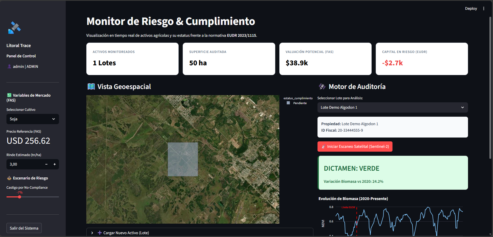
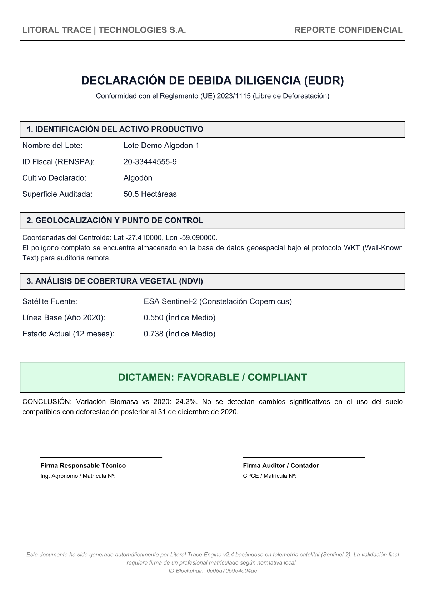

#Litoral Trace | Inteligencia Geoespacial & Compliance EUDR

[](https://www.python.org/)
[](https://streamlit.io/)
[](https://neon.tech/)
[](https://earthengine.google.com/)
[](./LICENSE)

> **Demo en Vivo:** [litoraltrace.streamlit.app](https://litoraltrace.streamlit.app)

---

##Resumen Ejecutivo

**Litoral Trace** es una plataforma SaaS (Software as a Service) desarrollada para auditar la cadena de suministro agrícola en el Gran Chaco Argentino.

Su objetivo principal es blindar las exportaciones ante la normativa **EUDR 2023/1115** (Reglamento de la Unión Europea sobre productos libres de deforestación), que prohíbe el ingreso de commodities producidos en tierras deforestadas después del 31 de diciembre de 2020.

Combinando **Telemetría Satelital (Sentinel-2)** con **Análisis de Datos Financieros**, la herramienta permite a productores y exportadores:
1.  **Auditar Activos:** Detección automática de cambios en el uso del suelo mediante series temporales de NDVI.
2.  **Calcular Riesgo:** Estimación de pérdidas financieras (Descuento FAS) por incumplimiento normativo.
3.  **Certificar Origen:** Generación de documentos de Debida Diligencia (PDF) listos para auditoría.

---

##Vistas de la Plataforma

### 1. Monitor Geoespacial en Tiempo Real
*Dashboard interactivo con superposición de lotes, alertas de compliance (Verde/Rojo) y valoración económica en vivo.*
 *(Asegúrate de subir tu captura a la carpeta assets)*

### 2. Motor de Análisis de Biomasa
*Procesamiento de series temporales (2020-Presente) para determinar la línea base de vegetación.*


---

##Arquitectura Técnica

El sistema utiliza una arquitectura **Serverless** moderna para garantizar escalabilidad y reducir costos de infraestructura.

```mermaid
graph TD
    User[Usuario / Agrónomo] -->|Interacción| UI[Frontend Streamlit]
    
    subgraph "Núcleo de Procesamiento"
        UI -->|Auth & Consultas| Py[Backend Python]
        Py -->|Cálculo Geoespacial| GEE[API Google Earth Engine]
        Py -->|Datos de Mercado| YF[Yahoo Finance API]
    end
    
    subgraph "Persistencia de Datos"
        Py -->|Gestión de Lotes/Usuarios| Neon[(Neon Serverless Postgres)]
        GEE -->|Imágenes Satelitales| Sentinel[Constelación Sentinel-2]
    end
    
    subgraph "Salida (Output)"
        Py -->|Generación| PDF[Reporte Due Diligence]
        Py -->|Visualización| Plotly[Gráficos Interactivos]
    end
